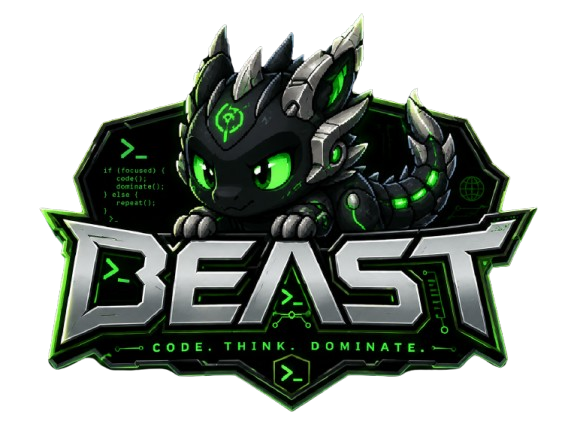

<p align="center">
  
</p>

# BEAST - Auditable, Governed AI Editing via MCP and Gateway

BEAST is an auditable governance layer for coding agents and editor clients. It
sits between your repository, local tools, MCP clients, and model providers so
models can propose work while BEAST owns the hard parts: context selection,
policy checks, safe patch compilation, verification, rollback evidence, and
multi-provider routing through one governed gateway.

Economic and "inversion" claims should be treated as an open research question
until the blinded public benchmark harness in `benchmarks/public_economic_thesis_harness.py`
has been run with published baselines, grading packets, and full cost ledgers.

The current upgrade turns BEAST from a collection of strong subsystems into a
more coherent agentic IDE runtime:

- Code Cortex is now the default front door for code context.
- SourcePlan is the governed edit and apply path.
- Mission Lattice can scaffold replay candidates without auto-applying them.
- CapabilityPlane unifies skills, plugins, commons candidates, exchanges, and
  local capability evidence.
- Evidence Bus indexes the proof chain and supports operational lookup.
- The TUI exposes clearer code panes, hunk selection, policy decisions,
  verification state, rollback status, and lattice replay candidates.
- MCP and HTTP surfaces share the same policy, source, context, and capability
  planes.

> Models propose. BEAST scopes, gates, compiles, verifies, records, learns, and
> rolls back.

---

## Why BEAST Exists

Coding agents fail when they are given too much freedom and too little local
structure. Common failure modes include full-file rewrites for tiny edits,
stale context, invalid JSON, unsafe shell commands, provider confusion, hidden
test failures, and tool calls that produce no useful evidence.

BEAST changes the contract:

1. The agent receives a bounded, task-shaped view of the workspace.
2. The model returns structured intent, not arbitrary file mutations.
3. BEAST compiles that intent into local SourcePlans.
4. Policy gates decide what is allowed before changes land.
5. Verification, rollback, and evidence closure become first-class outputs.
6. Successful patterns can be reused through the Mission Lattice and compute
   governor, but only through gated replay.

---

## What Changed In The Gortex Upgrade Cycle

This branch absorbed the useful architectural lessons from Gortex-style code
intelligence while keeping BEAST's stronger governance model.

### Code Intelligence

Code Cortex now acts as the central code-context facade. WorkspaceGraph,
Gortex/local indexers, symbol lookup, file summaries, dependents, and edit
impact analysis are treated as adapters behind a single route:

```text
GET  /edgek/code-cortex/status
GET  /edgek/code-cortex/symbols
GET  /edgek/code-cortex/file-summary
GET  /edgek/code-cortex/dependents
GET  /edgek/code-cortex/editing-context
POST /edgek/code-cortex/symbol-plan
POST /edgek/workspace/context
```

`/edgek/workspace/context` now carries `context_front_door =
"code_cortex"` and enriches context packets with Code Cortex files, symbols,
impact, and receipts.

### SourcePlan Workbench

SourcePlan is the operator-safe edit loop:

```text
POST /edgek/sourceplan/scorecard
POST /edgek/sourceplan/preview
POST /edgek/sourceplan/verify
POST /edgek/sourceplan/apply
POST /edgek/sourceplan/lattice-replay
```

The scorecard now carries a Source Workbench view model with:

- selected hunks and code-pane state
- policy gate decision
- verification plan and status
- rollback path
- evidence closure path
- lattice replay candidate details
- CapabilityPlane hints

The TUI supports keyboard and mouse selection, click-to-select hunks,
double-click toggles, clearer diff visibility, and a more compact cockpit.

### Mission Lattice Replay

The Mission Crystal Lattice identifies reusable edit patterns from proven
SourcePlan evidence. It no longer stops at advisory similarity. It can now
build a replay-gated scaffold:

```text
lattice match -> SourcePlan scaffold -> policy gate -> verification plan
-> evidence closure
```

Replay is deliberately non-destructive. It does not auto-apply changes. Replay
outcomes are fed back into provider edit fitness and scheduler economics.

```text
POST /edgek/mission-lattice/replay-scaffold
```

### CapabilityPlane

CapabilityPlane is the single read facade for capability routing and promotion.
It combines:

- Capability Registry
- Skill Tree
- Plugin Marketplace
- Capability Exchange
- Meta Tool Commons
- local reusable capability evidence

Routes and tools can now ask one question: which capabilities are available,
verified, local, reusable, risky, or promotion-ready?

```text
GET  /edgek/capability-plane/summary
POST /edgek/capability-plane/query
```

### Evidence Bus

Evidence Bus indexes SourcePlan packets, policy decisions, lattice closures,
and replay evidence so MCP, TUI, and HTTP callers can query the same proof
chain.

```text
GET  /edgek/evidence-bus/summary
POST /edgek/evidence-bus/query
POST /edgek/evidence-bus/related
```

Useful filters include task id, plan id, artifact type, source, status, and
relationships such as "everything related to this SourcePlan apply".

### Policy Gates

BEAST now normalizes policy decisions across the major gates:

- Mode Router
- Spec Covenant
- Safety Governor
- SourcePlan
- Output Governor
- Agent Passport

The goal is one policy decision shape everywhere, so cockpit/source workbench
views can show one operator-readable answer instead of scattered local checks.

### Route Modularization

The FastAPI surface has been split into route families while preserving public
paths:

```text
app/routes/sourceplan.py
app/routes/compute.py
app/routes/workspace.py
app/routes/commons.py
app/routes/cockpit.py
app/routes/policy.py
```

`app/main.py` still contains legacy handlers during the transition, but module
routes are mounted first and active duplicates are removed at startup. Tests
assert that the important paths are owned by `app.routes.*`.

---

## Core Architecture

| Layer | Responsibility |
|---|---|
| TUI and MCP | Human/operator and client-facing control planes |
| Source Workbench | Preview, selection, verification, apply, rollback, evidence |
| Code Cortex | Canonical code context and edit-impact facade |
| SourcePlan | Structured edit contract and local patch compiler |
| Policy Gate | Mode, spec, safety, output, passport, and SourcePlan decisions |
| Evidence Bus | Searchable proof chain for plans, policies, replay, and closures |
| CapabilityPlane | Unified capability discovery, risk, reuse, and promotion view |
| Mission Cockpit | Compact operational dashboard for plans, worktrees, policies, evidence |
| Mission Lattice | Proven edit-pattern matching and replay-gated scaffolding |
| Compute Governor | Probabilistic compute accounting, reuse, displacement, receipts |
| Provider Economist | Provider, route, model, cost, latency, and rescue-fitness selection |
| Commons | Privacy-safe capability evidence exchange and local adoption gates |

---

## How This Improves BEAST

The upgrade meaningfully improves BEAST in five ways.

First, code intelligence is less fragmented. Context flows through Code Cortex,
which makes TUI, MCP, HTTP, and SourcePlan decisions easier to compare and
debug.

Second, edits are more visible. The Source Workbench now shows the actual code
and diff state, selected hunks, policy results, verification state, rollback,
and evidence closure instead of hiding those details inside backend packets.

Third, reuse is operational instead of magical. Mission Lattice can suggest and
scaffold replay, but every replay still goes through SourcePlan, policy,
verification, and evidence closure.

Fourth, routing has a stronger capability model. CapabilityPlane lets BEAST
reason over local skills, plugins, commons candidates, verified capabilities,
and risk from one surface instead of scattered registries.

Fifth, the system is easier to maintain. Route families now have clear
ownership, active duplicate paths are suppressed, and tests lock down the
new ownership boundaries.

---

## Quick Start

```bash
git clone https://github.com/Byron2306/EdgeK-BEAST.git
cd EdgeK-BEAST
pip install -r requirements.txt
```

Optional LiteLLM proxy support:

```bash
pip install -r requirements-litellm.txt
```

Bring up the full backend stack (gateway, proxy lane, MCP HTTP, LiteLLM, Ollama, and nginx):

```bash
venv/bin/python bin/beast heal \
  --host 127.0.0.1 \
  --gateway-port 8101 \
  --mcp-port 8765 \
  --litellm-port 4000 \
  --nginx-port 8080 \
  --ollama-host 127.0.0.1:11434 \
  --restart-all true \
  --kill-address-pids true
```

Short form using the same defaults:

```bash
./bin/beast heal
```

Health checks:

```bash
curl http://127.0.0.1:8101/health
curl http://127.0.0.1:8765/mcp/health
curl http://127.0.0.1:8080/health
```

Point an OpenAI-compatible agent at BEAST:

```bash
export OPENAI_BASE_URL=http://localhost:8101/v1
```

Point an Anthropic-compatible agent at BEAST:

```bash
export ANTHROPIC_BASE_URL=http://localhost:8101
```

Launch the TUI:

```bash
python3 -m app.cli.ui
```

---

## Provider Setup

Set the provider keys you want BEAST to route across:

```bash
export XAI_API_KEY='...'
export OPENROUTER_API_KEY='...'
export HF_TOKEN='...'
export NVIDIA_API_KEY='...'
export MISTRAL_API_KEY='...'
export COHERE_API_KEY='...'
export GEMINI_API_KEY='...'
```

Unconfigured providers are skipped cleanly. Provider fitness is tracked
separately from BEAST-rescued completion, so the system can distinguish clean
model performance from local rescue.

---

## Important Endpoints

```text
# Gateway
GET  /health
GET  /edgek/state
GET  /ui

# Drop-in provider surfaces
POST /v1/chat/completions
POST /v1/messages
POST /hf/v1/chat/completions
POST /litellm/v1/chat/completions

# SourcePlan
POST /edgek/sourceplan/scorecard
POST /edgek/sourceplan/preview
POST /edgek/sourceplan/verify
POST /edgek/sourceplan/apply
POST /edgek/sourceplan/lattice-replay

# Code Cortex and workspace
GET  /edgek/code-cortex/status
GET  /edgek/code-cortex/symbols
GET  /edgek/code-cortex/file-summary
GET  /edgek/code-cortex/dependents
GET  /edgek/code-cortex/editing-context
POST /edgek/workspace/context
POST /edgek/workspace/index

# Mission cockpit, evidence, lattice
GET  /edgek/mission-cockpit/summary
GET  /edgek/mission-lattice/summary
POST /edgek/mission-lattice/lookup
POST /edgek/mission-lattice/replay-scaffold
GET  /edgek/evidence-bus/summary
POST /edgek/evidence-bus/query
POST /edgek/evidence-bus/related

# Capability and policy
GET  /edgek/capability-plane/summary
POST /edgek/capability-plane/query
GET  /edgek/mode-router/catalog
POST /edgek/spec-covenant/compile
POST /edgek/safety-governor/classify-command

# Compute and commons
GET  /edgek/compute
GET  /edgek/compute/metrics
GET  /edgek/crystal-compute
GET  /edgek/meta-tool-commons
GET  /edgek/commons-spaces
GET  /edgek/federated-commons

# MCP broker and runtime
POST /edgek/mcp/evaluate
POST /edgek/mcp/execute
GET  /edgek/mcp/audit
GET  /edgek/runtime/state
GET  /edgek/runtime/attempts
```

---

## MCP Tools

The MCP runtime exposes BEAST operations directly to agent clients, including:

- `beast_sourceplan_scorecard`
- `beast_sourceplan_preview_hunks`
- `beast_sourceplan_apply_selected`
- `beast_code_cortex_editing_context`
- `beast_capability_plane_summary`
- `beast_capability_plane_query`
- `beast_evidence_bus_query`
- `beast_mission_lattice_replay_scaffold`

Tool allowlists can be constrained with the existing BEAST MCP environment
controls when running in stricter modes.

---

## Benchmarks And Evidence

BEAST keeps local benchmark and proof artifacts under `benchmarks/results/` and
`.beast/evidence/`.

Current deterministic benchmark verdict surfaces:

- `benchmarks/results/full_blind_test_packet/provisional_verdict.json`: verifier-seeded preliminary verdict.
- `benchmarks/results/full_blind_test_packet/structural_verdict.json`: deterministic structure-and-evidence verdict.
- `benchmarks/results/full_blind_test_packet/grading_daemon_run.json`: latest grading daemon receipt.

The current full packet reports `supported` on both provisional and structural lanes, but that is still weaker than independent blind human grading and should be treated as machine-generated evidence rather than final proof.

Useful checks:

```bash
python3 -m pytest tests/test_agent_scheduler_mission_cockpit.py \
  tests/test_mission_crystal_lattice.py \
  tests/test_capability_plane.py \
  tests/test_context_packet.py -q
```

Broader reintegration checks:

```bash
python3 -m pytest tests/test_policy_gate_result.py \
  tests/test_reintegration_evidence_bus.py \
  tests/test_mission_crystal_lattice.py \
  tests/test_agent_scheduler_mission_cockpit.py \
  tests/test_spec_covenant_safety.py \
  tests/test_mode_router_worktree_forge.py \
  tests/test_mcp_runtime_v2.py \
  tests/test_sourceplan_bridge.py \
  tests/test_sourceplan_evidence.py \
  tests/test_code_cortex.py \
  tests/test_context_packet.py \
  tests/test_capability_plane.py \
  tests/test_output_governor.py \
  tests/test_memory_hull_residue_passport.py -q
```

---

## Configuration

`policies/default.yaml` controls local operating rules:

- provider budgets and token caps
- shell command allowlists and blocklists
- write restrictions
- MCP trust and approval rules
- circuit breaker thresholds
- tool laziness and capability promotion behavior
- policy gate defaults

Local BEAST state is stored under `.beast/` unless a route or client is given a
different workspace root.

---

## What BEAST Does Not Do

- It does not replace model providers. It governs how agents use them.
- It does not silently apply lattice replay. Replay is scaffolded, gated, and
  verified.
- It does not share source code with Commons. Commons exchanges privacy-safe
  capability evidence and local adoption remains policy-gated.
- It does not treat a rescued patch as clean model success. Clean provider
  performance and BEAST-rescued reliability are tracked separately.

---

## Overall Assessment: Agentic Loop And VS Code Parity

BEAST is now a serious governed coding-agent platform rather than a thin model
chat wrapper. Its strongest capability is the safety-critical loop: inspect
bounded context, plan, propose structured edits, compile a SourcePlan, require
approval, verify in an isolated target, repair failures, preserve rollback
evidence, and apply only after the contract is satisfied. This loop works with
remote worktrees, disposable SSH/devcontainer targets, local Ollama, NIM, and
hosted providers, with provider failover and heuristic continuation available
when a local route stalls.

The practical assessment is deliberately conservative:

| Area | Assessment | What is solid | What remains |
|---|---:|---|---|
| Governed agent loop | High | SourcePlan, approval, verification, repair, rollback, evidence | Long-horizon planning and difficult multi-file repairs still need stronger model supervision |
| Provider resilience | High | Gateway routing, timeout failover, route memory, telemetry, escalation | Small local models can still produce weak edits or stall before a useful first token |
| Workspace and remote execution | High | Target-side reads, mutation, verification, SSH/devcontainer routing | Long-lived interrupted-session soak coverage must keep expanding |
| VS Code-style editor | Medium-high | Monaco workbench, files, buffers, panes, diffs, terminals, tasks, tests, notebooks | Deep language-service behavior, debug ergonomics, and extension-host fidelity are not complete |
| LSP, indexing, debug, tests | Medium | Multiple adapters, discovery, diagnostics, verifier routing, debug foundations | Full cross-language LSP UX, test history/explorer depth, and adapter breadth remain behind VS Code |
| Extensions | Medium | Governed host foundation, contributions, storage/task/terminal surfaces | Real popular extensions with messy dependencies and webviews still require broader workload validation |
| UI cockpit | Medium-high | Unified run stages, provider state, approvals, verification, and evidence surfaces | Some pages and complex layouts still need continued visual and responsive hardening |

In short, BEAST is competitive as a governed, auditable agent runtime and is
approaching useful parity for the core coding workflow. It is not honestly
100% VS Code parity yet: VS Code still leads in extension compatibility,
language-server depth, debugger polish, test explorer maturity, and years of
edge-case UX hardening. The next highest-value work is not more decorative
surface area; it is proving the loop on messy large repositories, improving
semantic patch quality for weak local models, and running real extension and
remote-session soak workloads continuously.

The success criterion for the next phase is therefore outcome-based: a user
should be able to start with an ambiguous task, let BEAST inspect and plan,
review bounded edits, run targeted verification inside the actual target,
repair failures, and finish with a trustworthy apply receipt without manually
translating model prose. Any route that cannot do that should remain visibly
advisory rather than pretending it completed.

## Status

Active development. The current system has moved beyond the original gateway:
it is now a governed coding-agent runtime with Code Cortex, SourcePlan,
CapabilityPlane, Evidence Bus, Mission Cockpit, Mission Lattice replay, and
crystallized compute feedback loops.

The remaining cleanup direction is mostly hardening: retire old inline route
bodies from `app/main.py`, broaden end-to-end TUI/MCP/HTTP replay tests, and
continue migrating any direct graph/context callers into Code Cortex.

## License

MIT - see [LICENSE](LICENSE).
