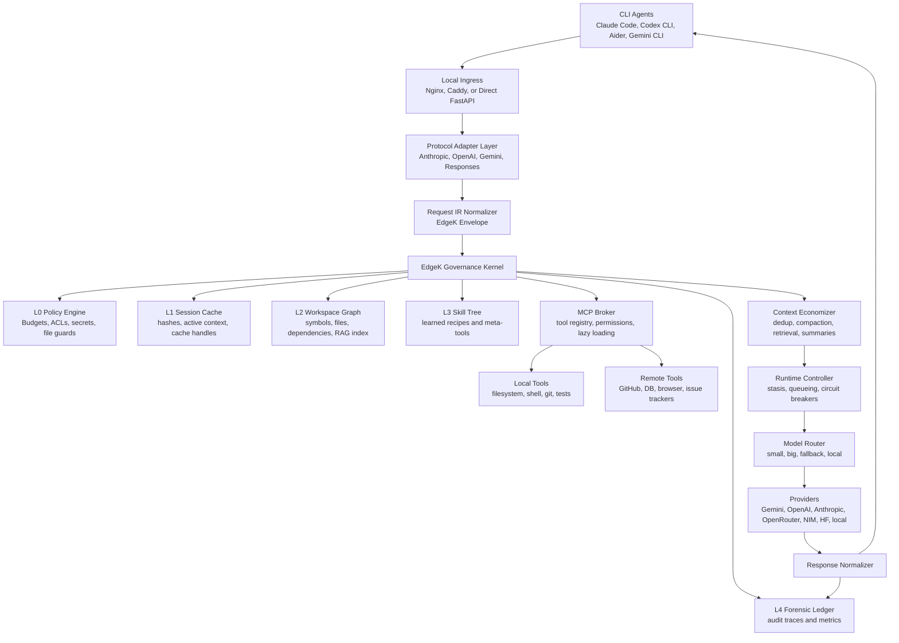
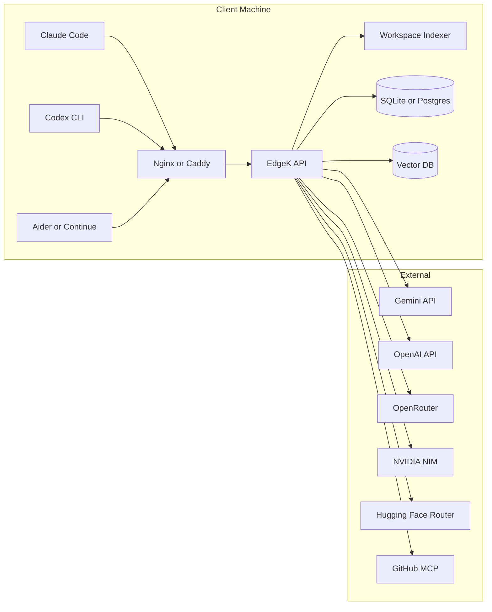
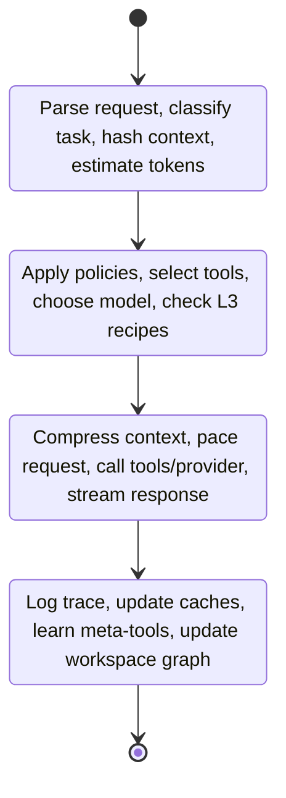
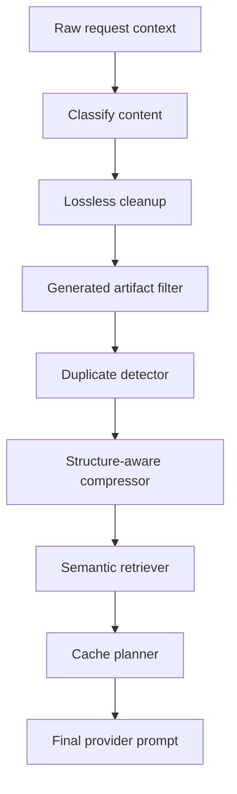
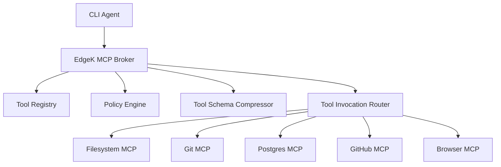
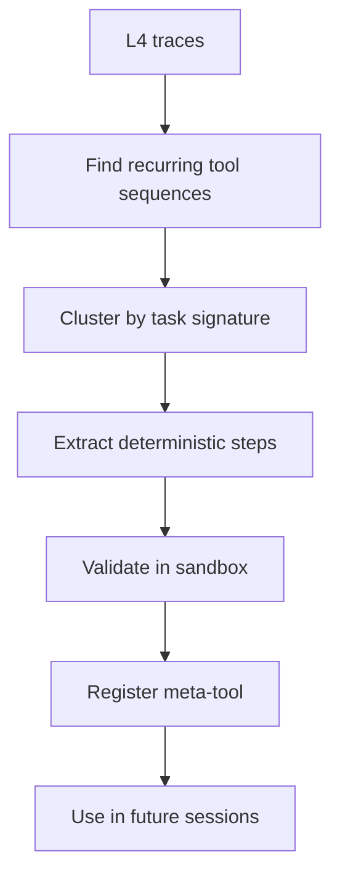
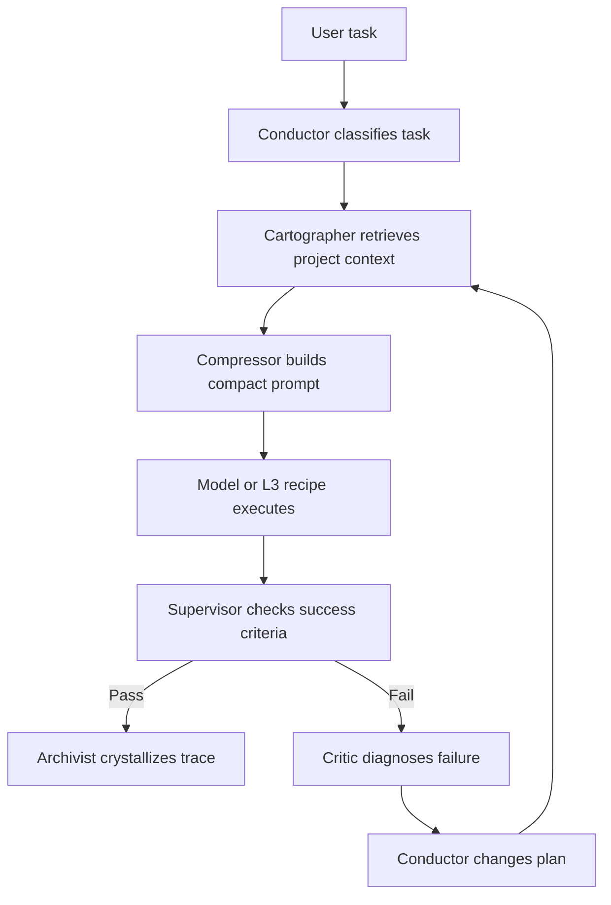
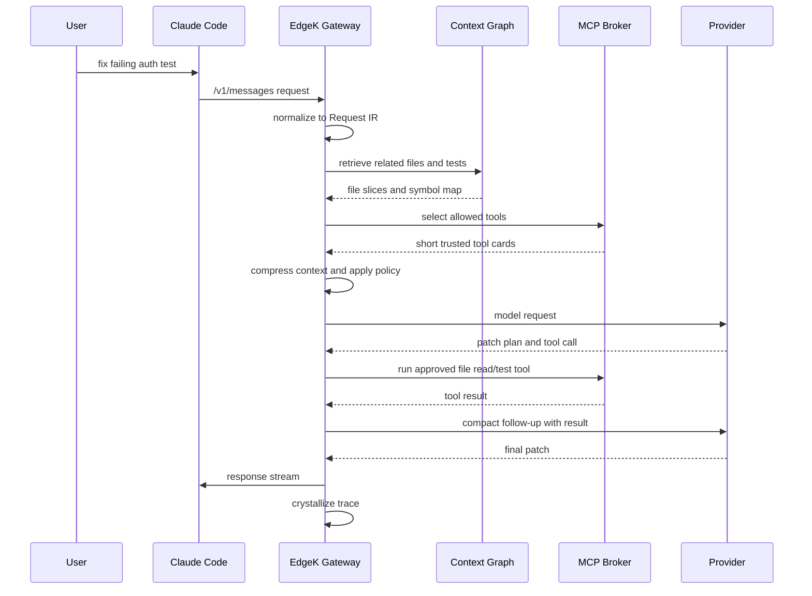

# EdgeK BEAST: A Governed MCP and LLM Gateway Architecture for Token-Efficient Agentic Coding

**Document type:** System architecture whitepaper  
**Prepared for:** Byron Bunt  
**Date:** 10 June 2026  
**Status:** Concept synthesis, architecture summary, implementation blueprint  
**Primary design goal:** Maximize useful agentic coding work per token, request, and rand without bypassing provider limits, terms, or security controls.

---

## 1. Executive Summary

The uploaded discussion proposes a local or team-hosted gateway that sits between command-line AI coding clients, model providers, and MCP tool servers. The core idea is strong: make the gateway the single control plane for authentication, routing, token accounting, prompt compression, MCP tool governance, runtime loop control, and provider failover.

The strongest version of the system is not a "stealth" token bypasser. It is a **governed agentic execution broker**. It improves efficiency by controlling what context reaches the model, which model handles each task, how tools are exposed, how repeated work is cached, how rate limits are respected, and how agent loops are interrupted before they become token bonfires.

This whitepaper turns the discussion into a coherent architecture called **EdgeK BEAST**:

> **EdgeK BEAST** is a local-first, policy-governed LLM and MCP gateway for agentic coding workflows. It aggregates multiple model providers, brokers MCP tools, compacts context, manages caches, paces requests, detects wasteful loops, and learns reusable meta-tools from successful traces.

The design is grounded in five architectural commitments:

1. **Protocol unification:** Support Anthropic-style clients, OpenAI-compatible clients, Gemini, NIM, OpenRouter, Hugging Face, and other providers through normalized request envelopes.
2. **Context economy:** Compress, summarize, index, and retrieve local project context before it becomes expensive prompt bulk.
3. **MCP tool governance:** Expose only the right tools at the right time, with least privilege, dynamic loading, schema trimming, and strong tool-poisoning defenses.
4. **Runtime control:** Use leaky-bucket pacing, queueing, timeout budgets, loop circuit breakers, and deterministic meta-tools to prevent agentic thrashing.
5. **Forensic observability:** Record every request, compression decision, tool call, cache hit, provider error, and loop intervention for auditing and continuous optimization.

The practical benefit is not magical infinite context. The practical benefit is a measurable reduction in wasted tokens and failed loops while preserving coding quality.

---

## 2. What the Original Discussion Gets Right

The uploaded thread contains the bones of a very useful system:

| Idea from the discussion | Architectural value |
|---|---|
| CLI proxy gate between coding clients and LLM providers | Centralizes API keys, rate limits, routing, logging, and cost policy. |
| LiteLLM or similar gateway as routing backbone | Provides a single abstraction over many providers and model APIs. |
| Claude Code and Codex CLI redirection through local base URLs | Lets existing developer tools use the gateway without changing user habits. |
| Nginx reverse proxy in front of the runtime | Useful for TLS, buffering, connection handling, local network access, and service composition. |
| Token stripping and context squeezing | Correct as a category, but should be safer and more structural than regex comment removal. |
| Prompt caching and stable prefixes | Essential for repeated repository context and long-running sessions. |
| Sliding-window context management | Necessary for agentic loops that accumulate logs and stale attempts. |
| Local vectorization and code graphing | One of the highest leverage ideas, because file reads dominate coding-agent context. |
| MCP aggregation | Critical, because tool definitions and ungoverned tool discovery can become permanent prompt tax. |
| Runtime circuit breakers | Very useful for repeated failed tests, repeated edits, and request storms. |
| KnowEdge or EdgeK L0-L4 memory stack | A good conceptual scaffold for policy, working memory, project facts, learned recipes, and forensic traces. |
| Swarm personas | Useful if implemented as internal roles and gates, not as wasteful independent chat agents. |
| Meta-tool compilation | Strongest long-term optimization. If repeated tool chains are converted to deterministic commands, the system reduces both model calls and failure surface. |

The discussion also correctly recognizes a key boundary: a proxy cannot force provider servers to accept larger context windows, hide input tokens from provider accounting, or bypass quotas. Efficiency must come from **doing less unnecessary work**, not pretending the provider cannot count.

---

## 3. Important Corrections and Improvements

### 3.1 Do not frame the system as bypassing billing or quotas

The system should be described as **authorized cost and token optimization**. Avoid language such as "bypass Anthropic", "free token milking", "stealth token usage", or "overclock context windows" in any public documentation. Those phrases attract the wrong kind of attention and obscure the genuinely valuable engineering.

Use this framing instead:

> EdgeK BEAST maximizes useful work per provider request by reducing redundant context, enforcing budget policies, routing tasks to appropriate models, and converting repeated tool workflows into deterministic meta-tools.

### 3.2 Regex stripping is too dangerous for code

The draft repeatedly proposes stripping comments and whitespace with regex. This is risky because comments may contain API contracts, TODOs, security notes, type hints, documentation blocks, generated-code warnings, lint directives, or test expectations.

Replace blind regex stripping with a **three-tier context economy pipeline**:

1. **Lossless cleanup:** ANSI log removal, trailing whitespace removal, duplicate log line folding, binary/blob detection, generated directory elision.
2. **Structure-aware compression:** AST or tree-sitter summaries, symbol maps, function signatures, import graphs, diff hunk extraction, stack-trace folding.
3. **Semantic compression:** prompt-aware retrieval and summarization only when the system can preserve anchors back to file paths and line ranges.

Rule: never destroy code semantics to save tokens. A compression step that causes a bad edit creates more token waste than it saves.

### 3.3 Nginx is not the intelligence layer

Nginx is excellent for ingress, buffering, local TLS, timeouts, and reverse proxying. It should not be treated as the component that understands tokens, MCP tools, prompt caches, or code graphs. Those responsibilities belong to the **EdgeK Kernel** behind the ingress layer.

### 3.4 Cache keep-alive pings need policy controls

The draft mentions keeping caches warm with background pings. This can waste quota, increase cost, and may violate provider expectations if implemented as artificial traffic. The safer design is:

- Use explicit cache APIs when available.
- Keep stable prompt prefixes at the front of requests.
- Set TTLs deliberately.
- Refresh only when a user-approved session is active.
- Log refreshes as billable actions.
- Disable automatic keep-alives by default.

### 3.5 MCP tools are security boundaries, not convenience toys

MCP introduces arbitrary data access and code execution paths. Tool descriptions can be untrusted. The gateway must validate tool manifests, enforce allowlists, require user consent for destructive tools, and sandbox tool execution.

### 3.6 Swarm should be a state machine first, multi-agent second

A naive swarm can multiply cost. The better design is an internal **swarm-of-functions**:

- Conductor selects the next stage.
- Critic detects repeated failures and bad edits.
- Supervisor enforces budgets and permissions.
- Archivist writes traces and learned recipes.
- Sentinel handles secrets, file policies, and destructive action gates.

Only spawn additional model calls when a measurable benefit justifies them.

### 3.7 The gateway needs a normal form

Cross-provider translation gets messy. The gateway should convert all inbound traffic into a provider-neutral **Request Intermediate Representation** before compression, policy, routing, and provider conversion.

This IR should preserve:

- messages
- roles
- content parts
- tool definitions
- tool calls
- tool results
- system prompts
- file references
- cache handles
- response stream events
- provider-specific extras
- budget annotations
- trace IDs

---

## 4. Terminology

| Term | Definition |
|---|---|
| **CLI Agent** | A developer-facing coding tool such as Claude Code, Codex CLI, Gemini CLI, Aider, Continue, or a custom script. |
| **Gateway** | The local or hosted service that receives model requests from CLI agents and routes them to providers. |
| **Provider** | A model backend such as Anthropic, OpenAI, Google Gemini, OpenRouter, NVIDIA NIM, Hugging Face Inference Providers, local Ollama, vLLM, or LM Studio. |
| **MCP** | Model Context Protocol, a standard for connecting AI applications to tools, data sources, prompts, and workflows. |
| **Tool tax** | The recurring token cost of sending tool schemas and descriptions to the model. |
| **Context tax** | The recurring token cost of sending stale chat history, repeated file contents, logs, and workspace summaries. |
| **Stasis Wall** | A request pacing and queueing mechanism that prevents rate-limit crashes. |
| **Circuit Breaker** | A runtime guard that interrupts repeated failures or repeated request patterns. |
| **Meta-tool** | A deterministic composite tool generated from repeated successful tool sequences. |
| **Skill Tree** | A library of reusable successful recipes, indexed by problem signature and workspace context. |
| **Forensic Ledger** | Append-only trace log for requests, tool calls, budgets, cache hits, provider errors, and policy events. |

---

## 5. Non-Goals and Ethical Boundaries

EdgeK BEAST should explicitly reject the following goals:

1. **No quota evasion:** The gateway must not rotate accounts or keys to bypass provider limits.
2. **No credential farming:** The gateway must not use stolen, borrowed, scraped, or consumer-session credentials in unauthorized ways.
3. **No hidden exfiltration:** User source code, prompts, API keys, logs, and tool outputs must not be sent to unapproved providers or third-party proxies.
4. **No context-window fraud:** The gateway cannot make a provider process more tokens than the provider allows.
5. **No destructive automation without consent:** File writes, shell commands, deployments, migrations, dependency changes, and secrets access require policy checks and, where appropriate, human approval.
6. **No unreviewed MCP trust:** MCP servers and tool manifests are untrusted until verified and permissioned.

This boundary language makes the project credible. It turns the system from a "token goblin" into a serious agentic infrastructure platform.

---

## 6. Architecture Overview

### 6.1 High-Level System Diagram



### 6.2 Service-Level View



---

## 7. System Principles

### 7.1 Local-first control

The default deployment should run on the developer machine. Team deployment is possible, but local-first reduces source code exposure and gives the developer clear control over which providers see which data.

### 7.2 Least-context principle

The model should receive the minimum context needed for the current task, plus reliable mechanisms to request more.

### 7.3 Stable-prefix principle

Large, repeated context should be placed at the front of prompts where provider caching can reuse it. Repository summaries, coding standards, and stable project facts should be prefix-stable.

### 7.4 Tool-laziness principle

Do not send every MCP tool to every model request. Load tools based on task intent, project policy, user consent, and provider/tool compatibility.

### 7.5 Determinism before reasoning

If a repeated workflow can be solved by a deterministic script or meta-tool, do not ask a model to reason through it again.

### 7.6 Failure is data

Every failed loop, 429, bad edit, timeout, and user rejection should update the forensic ledger. The gateway improves by mining trace patterns.

---

## 8. Layered Memory and Governance Model

The uploaded discussion introduces an L0-L4 model. The refined version should be implemented as follows.

| Layer | Name | Scope | Persistence | Examples |
|---|---|---|---|---|
| **L0** | Meta Rules | Immutable governance | Config files, policy DB | provider quotas, forbidden files, command allowlists, consent policy |
| **L1** | Insight Index | Active session state | in-memory plus optional Redis | recent request hashes, cache handles, compression decisions, active task plan |
| **L2** | Workspace Graph | Project facts | SQLite/Postgres plus vector DB | file tree, symbols, dependency map, architecture notes, ignored paths |
| **L3** | Skill Tree | Reusable recipes | SQLite/Postgres | "fix eslint import loop", "run migration then test", "summarize failing pytest output" |
| **L4** | Forensic Archive | Audit and telemetry | append-only logs | full request metadata, tool traces, token estimates, circuit breaker events |

### 8.1 L0: Meta Rules

L0 governs what must never happen without explicit approval.

Recommended L0 policies:

- Maximum requests per provider per minute.
- Maximum tokens per request by provider and model.
- Maximum spend per day and per project.
- Hard-blocked files: `.env`, `.pem`, private keys, credential stores.
- Soft-gated files: package manifests, migration files, infrastructure files.
- Shell command allowlist and denylist.
- MCP server allowlist.
- Remote provider allowlist per project.
- Human approval requirements for destructive operations.

### 8.2 L1: Session Insight Index

L1 stores active session mechanics:

- last request timestamps
- current rate-limit buckets
- last N prompt hashes
- recent file-read hashes
- current prompt cache IDs
- active context summary
- last known error signature
- loop counters
- currently selected provider and model
- active swarm role

### 8.3 L2: Workspace Graph

L2 prevents the model from repeatedly rediscovering the repository. It should store:

- file tree
- file ownership and modification times
- git status
- symbols and definitions
- imports and dependency edges
- test files linked to source files
- package manager and framework hints
- README and architecture digest
- ignored/generated paths
- embedding index for semantic retrieval

Use tree-sitter, ripgrep, ctags, language servers, or project-specific analyzers. Embeddings should complement structural indexing, not replace it.

### 8.4 L3: Skill Tree

L3 turns successful traces into reusable recipes.

A skill entry should include:

```yaml
skill_id: fix_python_import_cycle_pytest
problem_signature:
  language: python
  error_regex: "ImportError: cannot import name"
  stack_trace_shape: "pytest-import-cycle"
preconditions:
  - "project has pytest"
  - "cycle occurs in src package"
steps:
  - "read stack trace"
  - "extract import graph around failing modules"
  - "propose minimal dependency inversion"
  - "edit only selected import sites"
  - "run targeted pytest"
risk_level: medium
approval_required: false
success_criteria:
  - "targeted test passes"
  - "no unrelated file modifications"
telemetry:
  created_from_trace: "trace_2026_06_10_001"
  average_token_savings: null
```

### 8.5 L4: Forensic Archive

L4 enables debugging and research.

Store:

- request IDs
- user/task ID
- provider/model
- estimated and actual token usage
- cache hit/miss
- compression ratio
- tools offered
- tools called
- shell commands executed
- files read and modified
- policy events
- loop interventions
- user approvals and rejections
- final task outcome

For privacy, full prompts should be locally encrypted or redacted by default. Full prompt capture should be opt-in.

---

## 9. PREC Runtime Cycle

Every request should move through a deterministic cycle:



### 9.1 Perceive

Inputs:

- raw client payload
- environment metadata
- project context
- provider state
- MCP registry
- L1 session state

Outputs:

- normalized request envelope
- task classification
- token estimate
- risk classification
- cache candidates
- tool candidates
- loop signature

### 9.2 Reason

Decisions:

- answer from L3 skill tree or call model
- which model tier to use
- which tools to expose
- whether a tool call requires user approval
- whether context needs retrieval or summarization
- whether rate-limit pacing is required
- whether current request looks like a loop

### 9.3 Execute

Actions:

- apply safe compaction
- retrieve relevant context
- attach or reference cache handles
- apply stasis wall pacing
- call model or tools
- stream normalized response
- record partial telemetry

### 9.4 Crystallize

Post-actions:

- update L1 active state
- update L2 project graph if files changed
- save successful sequences into L3 candidates
- write L4 trace event
- adjust routing heuristics
- emit metrics

---

## 10. Component Architecture

### 10.1 Client Connector Layer

The gateway should support three client modes:

#### Anthropic-compatible mode

For Claude Code and Anthropic-style clients.

Typical environment pattern:

```bash
export ANTHROPIC_BASE_URL="http://127.0.0.1:8080"
export ANTHROPIC_API_KEY="local-edgek-key"
claude
```

Optional Claude Code variables to support gateway use:

```bash
export CLAUDE_CODE_ENABLE_GATEWAY_MODEL_DISCOVERY=1
export ENABLE_TOOL_SEARCH=auto
export CLAUDE_CODE_PROPAGATE_TRACEPARENT=1
```

The gateway must support `/v1/messages`, streaming responses, tool calls, and Anthropic-flavored error handling if Claude Code is the primary client.

#### OpenAI-compatible mode

For Codex-style CLIs, Aider, Continue, OpenHands, and OpenAI SDK tools.

```bash
export OPENAI_BASE_URL="http://127.0.0.1:8080/v1"
export OPENAI_API_KEY="local-edgek-key"
```

Must support:

- `/v1/chat/completions`
- `/v1/responses`, where relevant
- `/v1/models`
- streaming
- tool calls
- usage accounting

#### Native or direct mode

For custom scripts and advanced users.

```bash
edgek run "fix failing tests" --project . --budget cheap --model auto
```

This mode can access richer gateway features than protocol-compatible clients.

---

### 10.2 Ingress Layer

Recommended options:

| Option | Best for | Notes |
|---|---|---|
| Direct FastAPI/Uvicorn | Local single-user development | Simplest, least moving parts. |
| Nginx | Local network or team gateway | TLS, buffering, timeouts, reverse proxying. |
| Caddy | Easy local TLS | Simple config, good developer experience. |
| Traefik | Container stack | Useful with Docker Compose and service discovery. |

Nginx should handle:

- TLS termination
- connection buffering
- long read timeouts
- local network binding
- reverse proxying
- basic access restrictions

Nginx should not handle:

- token counting
- model routing
- MCP permissions
- prompt caching
- semantic compression
- code indexing

Example local ingress:

```nginx
events {
    worker_connections 1024;
}

http {
    upstream edgek_backend {
        server 127.0.0.1:8000;
    }

    server {
        listen 8080;
        server_name localhost;

        client_max_body_size 50m;

        location / {
            proxy_pass http://edgek_backend;
            proxy_set_header Host $host;
            proxy_set_header X-Real-IP $remote_addr;
            proxy_set_header X-Request-ID $request_id;
            proxy_read_timeout 600s;
            proxy_connect_timeout 60s;
            proxy_send_timeout 600s;
            proxy_buffering off;
        }
    }
}
```

---

### 10.3 Protocol Adapter Layer

The adapter layer converts inbound provider-specific formats into the EdgeK Request IR.

Supported adapters:

| Inbound API | Endpoint | Output |
|---|---|---|
| Anthropic Messages | `/v1/messages` | EdgeK Request IR |
| OpenAI Chat Completions | `/v1/chat/completions` | EdgeK Request IR |
| OpenAI Responses | `/v1/responses` | EdgeK Request IR |
| Gemini generateContent | optional | EdgeK Request IR |
| MCP tool calls | `/mcp`, `/mcp-rest/*` | EdgeK Tool IR |

The adapter should be bidirectional. Responses from providers should be converted back into the client’s expected response shape.

---

### 10.4 Request Intermediate Representation

A normalized request envelope prevents every module from needing to understand every provider.

Example:

```yaml
edgek_request:
  id: req_01H...
  trace_id: trace_01H...
  client:
    kind: claude_code
    protocol: anthropic_messages
    version: unknown
  user:
    local_user: byron
    project_id: vamp-web
  task:
    class: code_debug
    risk: medium
    intent: fix_tests
  model_request:
    preferred_model: auto
    max_output_tokens: 4096
    reasoning_budget: medium
    stream: true
  messages:
    - role: system
      content_parts:
        - type: text
          text: "..."
    - role: user
      content_parts:
        - type: text
          text: "..."
  tools:
    - name: filesystem.read
      schema_ref: tool_schema_hash_123
  context:
    workspace_root: "/home/byron/project"
    git_branch: "main"
    cache_candidates:
      - repo_summary_v4
  policy:
    budget_class: cheap
    allow_destructive_tools: false
  provider_extras:
    original_payload_hash: "..."
```

The IR should preserve unknown provider-specific fields under `provider_extras` so translation is not lossy.

---

## 11. Model Routing and Provider Strategy

### 11.1 Provider Abstraction

The gateway should support these provider classes:

| Provider class | Examples | Best use |
|---|---|---|
| Direct commercial APIs | OpenAI, Anthropic, Gemini | High quality, official support, reliable tool calling. |
| Aggregators | OpenRouter, Hugging Face Inference Providers | Model diversity and fallback experimentation. |
| Vendor microservices | NVIDIA NIM, vLLM, TGI | Local or enterprise-hosted workloads. |
| Local models | Ollama, LM Studio, llama.cpp | Cheap diagnostics, privacy-sensitive summarization. |

### 11.2 Model Tiers

Use capability tags rather than hardcoded model names.

```yaml
model_tiers:
  tiny:
    use_for:
      - classify_task
      - compress_logs
      - summarize_tool_result
      - choose_next_file
  small:
    use_for:
      - git_status_analysis
      - stack_trace_summary
      - lightweight_code_search
      - lint_explanation
  medium:
    use_for:
      - targeted_bug_fix
      - test_generation
      - small_refactor
  large:
    use_for:
      - architecture
      - multi-file refactor
      - hard debugging
      - security review
  local:
    use_for:
      - secret-safe summarization
      - private repo indexing
      - offline fallback
```

### 11.3 Routing Decision Matrix

| Task signal | Route |
|---|---|
| `git status`, `ls`, short logs | tiny or small |
| One failing test, clear stack trace | medium |
| Large multi-file refactor | large |
| Security-sensitive source | local or approved provider only |
| Tool schema compression | tiny or deterministic |
| Context retrieval | local index, no model if possible |
| Repeated known error | L3 skill recipe |
| Provider 429 | queue, fallback, or ask user depending policy |
| Low confidence after repeated failure | large model plus Critic intervention |

### 11.4 Fallback Strategy

Fallbacks should be policy-governed. Do not automatically send private code to a different provider unless the project allows it.

Example:

```yaml
fallback_policy:
  default:
    on_rate_limit:
      action: queue_then_retry
      max_wait_seconds: 120
    on_provider_error:
      action: fallback
      allowed_providers:
        - gemini
        - openrouter
    on_sensitive_context:
      action: local_only
```

---

## 12. Context Economizer

The Context Economizer is the heart of token reduction.

### 12.1 Context Pipeline



### 12.2 Content Classes

Classify content before compression:

| Class | Handling |
|---|---|
| User request | Preserve exactly unless user opted into compaction. |
| System/developer instruction | Preserve exactly. |
| File content | Summarize structurally unless active edit target. |
| Diff | Preserve changed hunks and surrounding context. |
| Stack trace | Fold repeated frames, preserve top and bottom frames. |
| Test output | Preserve failing tests, assertions, and first error cause. |
| Build logs | Deduplicate and keep unique errors/warnings. |
| Generated files | Replace with hash and metadata unless directly relevant. |
| Lockfiles | Summarize package changes unless task requires exact lockfile edit. |
| MCP tool descriptions | Use trusted short tool cards. |
| Secrets | Redact or block. |

### 12.3 Safe Compression Rules

Recommended rules:

1. Preserve user intent verbatim.
2. Preserve system instructions verbatim.
3. Preserve exact code for active edit targets.
4. Preserve exact failing assertions.
5. Preserve line numbers and file paths where possible.
6. Compress generated directories by default.
7. Compress repeated terminal lines by hash.
8. Never remove comments globally.
9. Never summarize secrets, block them.
10. Attach compression metadata to the trace.

### 12.4 Compression Metadata

Every compression should be explainable:

```json
{
  "compression_event": {
    "request_id": "req_123",
    "original_estimated_tokens": 43120,
    "compressed_estimated_tokens": 11890,
    "ratio": 0.276,
    "rules_applied": [
      "ansi_removed",
      "duplicate_log_fold",
      "node_modules_elided",
      "stack_trace_folded"
    ],
    "lossiness": "bounded",
    "anchors_preserved": true
  }
}
```

### 12.5 Workspace Graph Retrieval

When a model asks to read files, the gateway should prefer:

1. symbol lookup
2. dependency lookup
3. semantic search
4. grep/ripgrep
5. targeted file slices
6. full file read only when necessary

Example query expansion:

```yaml
retrieval_query:
  user_task: "fix login validation bug"
  active_error: "ValidationError in auth/schema.ts"
  retrieve:
    - symbols: ["LoginSchema", "validateUser"]
    - files_matching: ["auth", "login", "schema"]
    - tests_linked_to: ["auth/schema.ts"]
  max_context_tokens: 6000
```

### 12.6 Context Budget Contracts

Every request receives a budget:

```yaml
context_budget:
  total_input_budget: 64000
  reserved_for_system: 4000
  reserved_for_user_request: 2000
  reserved_for_tools: 8000
  reserved_for_retrieved_code: 30000
  reserved_for_recent_history: 10000
  reserved_for_scratch_summary: 10000
```

If the request exceeds budget, the system should degrade gracefully:

1. Trim repeated logs.
2. Replace old conversation with summary.
3. Reduce tool schemas.
4. Retrieve narrower file slices.
5. Ask the user before dropping high-risk context.

---

## 13. Prompt Caching Strategy

Prompt caching is most useful when the beginning of the prompt stays stable.

### 13.1 Cacheable Prefix

The cacheable prefix should include:

- immutable system instructions
- gateway behavior contract
- project architecture summary
- stable coding standards
- tool policy summary
- dependency graph digest
- key file map
- recent validated repository summary

Avoid putting volatile logs, current errors, timestamps, or random trace IDs in the prefix.

### 13.2 Explicit Cache Manager

The cache manager should track:

```yaml
cache_entry:
  provider: gemini
  model: selected-large
  cache_id: cachedContents/abc123
  prefix_hash: sha256...
  token_count: 48210
  created_at: "2026-06-10T14:00:00Z"
  ttl_seconds: 3600
  expires_at: "2026-06-10T15:00:00Z"
  project_id: vamp-web
  allowed_users:
    - byron
```

### 13.3 Cache Policy

Recommended defaults:

```yaml
cache_policy:
  explicit_cache:
    enabled: true
    min_tokens: 4096
    default_ttl_seconds: 3600
    refresh_mode: user_active_only
  implicit_cache:
    stable_prefix_enabled: true
  keep_alive:
    enabled: false
    requires_user_opt_in: true
```

### 13.4 Cache Reality Check

Cached tokens may reduce cost or latency, but they still belong to a provider-managed feature. The model’s context limit still applies. Standard rate limits still apply. Cache refreshes can still consume quota. Treat cache as an optimization, not a loophole.

---

## 14. MCP Gateway and Tool Governance

### 14.1 MCP Broker

The MCP Broker should act as one front door for many tools.



### 14.2 Tool Registry

Each tool must have a trusted manifest:

```yaml
tool:
  name: filesystem.read
  server: local_filesystem
  trust_level: trusted_local
  risk: low
  description_short: "Read approved project files."
  schema_hash: sha256...
  allowed_roots:
    - "/home/byron/projects"
  denied_patterns:
    - ".env"
    - "*.pem"
    - "id_rsa"
  requires_confirmation: false
```

### 14.3 Tool Exposure Modes

| Mode | Description | Use |
|---|---|---|
| Static upfront | Send all approved tools | Small toolsets only. |
| Lazy intent-based | Send only likely tools | Default mode. |
| Tool search | Defer tool loading if client and gateway support it | Large MCP fleets. |
| Direct gateway call | Model asks gateway, gateway calls tool internally | Maximum control. |

### 14.4 Schema Compression

Tool descriptions should be short, trusted, and stable.

Bad:

> This tool can recursively explore a directory tree, handle symlinks, expose raw file content, optionally search for metadata, and return many fields...

Better:

> Read approved project file slices by path and line range.

Schema compression should not hide risk. If a tool can write files, execute commands, or access remote systems, the description must clearly say so.

### 14.5 Tool Poisoning Defense

MCP tool metadata is an attack surface. Defenses:

- Only load tools from trusted servers by default.
- Hash and pin tool schemas.
- Validate schema diffs on startup.
- Strip hidden instructions from descriptions.
- Block tools whose descriptions contain prompt-injection phrases.
- Separate tool descriptions from model instructions.
- Display risky tool actions to user before execution.
- Log tool origin and schema hash in L4.

### 14.6 Tool Budgeting

Each request gets a tool budget:

```yaml
tool_budget:
  max_tool_calls: 12
  max_shell_calls: 3
  max_file_reads: 20
  max_file_write_ops: 5
  max_total_tool_seconds: 180
  max_mcp_servers_visible: 4
```

If the budget is exhausted, the gateway should inject a deterministic intervention:

> Tool budget exhausted. Summarize current evidence, propose next smallest action, and ask for approval before continuing.

---

## 15. Runtime Governance

### 15.1 Stasis Wall

The Stasis Wall is a leaky-bucket request scheduler.

It should track:

- provider
- model
- project
- user
- endpoint
- request weight
- estimated tokens
- retries
- provider reset times

Example:

```yaml
rate_limits:
  gemini:
    free_project:
      rpm: from_provider_dashboard
      tpm: from_provider_dashboard
      rpd: from_provider_dashboard
      strategy: leaky_bucket
  openrouter_free:
      rpm: 20
      daily_free_requests: account_policy
      strategy: queue_then_fallback
```

The Stasis Wall should never conceal provider exhaustion. It should show status:

```text
Gemini rate bucket is cooling down. Queue position: 2. Estimated retry: next allowed slot.
```

### 15.2 Circuit Breakers

Detect loops such as:

- same command repeated with same output
- same edit applied repeatedly
- same test failure after N attempts
- file read loops
- model alternates between two failed strategies
- request hash similarity above threshold
- tool errors repeated with no new evidence

Interventions:

| Loop type | Gateway action |
|---|---|
| Same failing test 3 times | Require different strategy and parent context. |
| Same file read repeatedly | Serve cached slice and warn model. |
| Repeated package install failure | Block retry and ask for package manager diagnosis. |
| Repeated full repo listing | Serve L2 file map. |
| Tool storm | Reduce tool budget and force summary. |

### 15.3 Circuit Breaker Message

Example injected system message:

```text
[EDGEK RUNTIME INTERVENTION]
You are repeating the same failing path. Stop retrying the last command or edit.
Current evidence:
- same test failed 3 times
- no new files were inspected
- last two patches touched the same function
Required next action:
1. summarize the failure cause in one paragraph
2. inspect the nearest caller or test fixture
3. propose a different patch strategy before editing
```

### 15.4 Timeout Budgeting

Tool calls should have adaptive timeouts:

| Tool | Default timeout | Notes |
|---|---:|---|
| file read | 5s | local only |
| grep/ripgrep | 15s | bounded paths |
| unit test targeted | 60s | single test file |
| full test suite | approval required | often expensive |
| package install | approval required | high risk |
| database migration | approval required | destructive potential |

### 15.5 Queue Policy

Possible queue actions:

- wait and retry
- fallback to another provider
- downgrade to smaller model
- ask user to continue later manually
- summarize current state and stop

The best default for local single-user development is **wait briefly, then summarize and stop cleanly**.

---

## 16. Meta-Tool Compiler

The Meta-Tool Compiler turns repeated successful traces into deterministic tools.

### 16.1 Trace Mining

Input:

```yaml
trace:
  task: "fix failing eslint import order"
  sequence:
    - read_file package.json
    - run npm test
    - grep eslint error
    - edit import order
    - run npm test
  outcome: success
  model_calls: 5
```

Candidate meta-tool:

```yaml
meta_tool:
  name: fix_eslint_import_order
  inputs:
    - file_path
    - error_log
  steps:
    - parse eslint import-order output
    - locate import block
    - sort imports according to project lint config
    - write patch
    - run targeted lint command
  requires_model: false
```

### 16.2 AWO Pipeline



### 16.3 Meta-Tool Acceptance Criteria

Only promote a meta-tool if:

- It has succeeded across multiple traces.
- It has deterministic inputs and outputs.
- It does not require hidden model reasoning.
- It has clear rollback behavior.
- It is bounded by file and command policy.
- It has tests or dry-run support.
- It logs its actions.

---

## 17. Swarm Design

### 17.1 Internal Roles

| Role | Responsibility | Model call required? |
|---|---|---|
| **Conductor** | Task orchestration and next-action selection | Usually no, can be deterministic. |
| **Supervisor** | Budget, policy, and completion checks | Usually no. |
| **Critic** | Failure-loop detection and strategy challenge | Sometimes. |
| **Archivist** | Trace capture and L3 skill updates | No. |
| **Sentinel** | Security and destructive-action gating | No. |
| **Cartographer** | Workspace graph and retrieval planning | Usually no. |
| **Compressor** | Context reduction | Often deterministic or small local model. |

### 17.2 Swarm Control Loop



### 17.3 Preventing Swarm Cost Explosion

Rules:

- Roles share one state ledger.
- Roles do not chat with one another by default.
- Critic is invoked only after failure or high-risk actions.
- Supervisor uses deterministic policies first.
- Multi-model debate is disabled by default.
- Any extra model call must log expected value.

---

## 18. Security Architecture

### 18.1 Threat Model

| Threat | Risk | Mitigation |
|---|---|---|
| API key leakage | Critical | local vault, env isolation, redaction, never log secrets |
| Tool poisoning | Critical | schema pinning, trusted registry, prompt-injection scanner |
| Shell command injection | Critical | command allowlists, sandbox, confirmation gates |
| Destructive file writes | High | protected files, patch previews, approval gates |
| Provider data leakage | High | provider allowlists per project, local-only mode |
| Malicious MCP server | High | sandbox, server allowlist, network restrictions |
| Prompt injection in repo files | High | treat repository text as data, not instructions |
| Quota exhaustion | Medium | leaky buckets, budgets, daily caps |
| Bad compression | Medium | preserve anchors, test output, active edit files |
| Trace privacy | Medium | encryption and redaction |

### 18.2 Secrets Policy

Never send or log:

- `.env`
- private keys
- OAuth tokens
- SSH keys
- cloud credentials
- database passwords
- personal access tokens
- cookie jars
- browser profiles
- raw credential stores

Replace with:

```text
[SECRET REDACTED: .env line 12, value withheld]
```

### 18.3 File Operation Policy

```yaml
file_policy:
  blocked:
    - ".env"
    - "*.pem"
    - "id_rsa"
    - ".ssh/**"
  approval_required:
    - "package.json"
    - "pnpm-lock.yaml"
    - "package-lock.json"
    - "Cargo.toml"
    - "go.mod"
    - "docker-compose.yml"
    - "infra/**"
    - "migrations/**"
  safe_read:
    - "src/**"
    - "tests/**"
    - "docs/**"
```

### 18.4 Shell Policy

```yaml
shell_policy:
  allow:
    - "git status"
    - "git diff"
    - "git log"
    - "npm test"
    - "npm run lint"
    - "pytest"
    - "cargo test"
  deny:
    - "rm -rf"
    - "curl * | sh"
    - "sudo"
    - "chmod 777"
    - "ssh *"
    - "scp *"
  approval_required:
    - "npm install"
    - "pip install"
    - "docker compose up"
    - "git push"
    - "db migrate"
```

---

## 19. Observability and Telemetry

### 19.1 Metrics

Minimum metrics:

```text
edgek_requests_total
edgek_provider_requests_total
edgek_input_tokens_estimated
edgek_output_tokens_reported
edgek_cache_hits_total
edgek_cache_misses_total
edgek_context_compression_ratio
edgek_tool_calls_total
edgek_tool_budget_exhausted_total
edgek_loop_interventions_total
edgek_rate_limit_events_total
edgek_provider_errors_total
edgek_queue_delay_seconds
edgek_cost_estimated_total
```

### 19.2 Trace Events

Example L4 trace:

```json
{
  "trace_id": "trace_2026_06_10_001",
  "request_id": "req_001",
  "event": "provider_call",
  "client": "claude_code",
  "provider": "gemini",
  "model_tier": "large",
  "task_class": "code_debug",
  "compression_ratio": 0.31,
  "tools_visible": ["filesystem.read", "git.diff", "test.run"],
  "tools_called": ["filesystem.read", "test.run"],
  "cache_hit": true,
  "estimated_input_tokens": 12880,
  "reported_output_tokens": 1024,
  "status": "success"
}
```

### 19.3 Dashboard

A simple local dashboard should show:

- active provider buckets
- session token usage
- top token-heavy files
- compression savings
- cache hit rate
- loop interventions
- tool-call counts
- failed commands
- provider errors
- daily budget remaining

---

## 20. Data Storage

### 20.1 Recommended Storage Stack

| Data | Store |
|---|---|
| L0 policies | YAML plus SQLite/Postgres |
| L1 active cache | in-memory or Redis |
| L2 workspace graph | SQLite/Postgres |
| L2 embeddings | Chroma, Qdrant, LanceDB, or SQLite vector extension |
| L3 skill tree | SQLite/Postgres |
| L4 forensic logs | JSONL files plus SQLite/Postgres index |
| secrets | OS keyring, 1Password CLI, Doppler, Vault, or encrypted local file |

### 20.2 Suggested Repository Structure

```text
edgek-beast/
  app/
    main.py
    config.py
    adapters/
      anthropic_messages.py
      openai_chat.py
      openai_responses.py
      gemini.py
    kernel/
      perceive.py
      reason.py
      execute.py
      crystallize.py
      policy.py
      router.py
      cache_manager.py
      stasis.py
      circuit_breaker.py
      token_counter.py
    context/
      compressor.py
      retriever.py
      code_graph.py
      tree_sitter_index.py
      log_folder.py
    mcp/
      broker.py
      registry.py
      schema_guard.py
      permissions.py
    skills/
      miner.py
      compiler.py
      registry.py
    telemetry/
      traces.py
      metrics.py
      redaction.py
  policies/
    default.yaml
    project.example.yaml
  configs/
    litellm.yaml
    nginx.conf
  data/
    .gitkeep
  docker-compose.yml
  README.md
```

---

## 21. Integration with LiteLLM

### 21.1 Why LiteLLM Fits

LiteLLM is useful as a provider gateway because it supports many providers through common interfaces, provides proxy server functionality, and includes gateway features such as routing, logging, guardrails, and load balancing.

### 21.2 Correct Callback Shape

The draft used a simplified callback form. In production, callbacks should follow the LiteLLM custom callback pattern rather than a bare function name.

Conceptual shape:

```python
from litellm.integrations.custom_logger import CustomLogger

class EdgeKProxyHandler(CustomLogger):
    async def async_pre_call_hook(self, user_api_key_dict, cache, data, call_type):
        # Convert data to EdgeK Request IR
        # Apply L0-L4 governance
        # Return modified data or rejection response
        return data

proxy_handler_instance = EdgeKProxyHandler()
```

Config shape:

```yaml
model_list:
  - model_name: small-coding
    litellm_params:
      model: gemini/gemini-selected-small
      api_key: os.environ/GEMINI_API_KEY

  - model_name: large-coding
    litellm_params:
      model: gemini/gemini-selected-large
      api_key: os.environ/GEMINI_API_KEY

litellm_settings:
  drop_params: true
  callbacks: edgek_callbacks.proxy_handler_instance
```

The exact provider model IDs should be kept in config and updated as provider availability changes.

### 21.3 When to Build Outside LiteLLM

LiteLLM can be the model gateway, but EdgeK-specific intelligence may be cleaner as a FastAPI service that calls LiteLLM internally.

Recommended production shape:

```text
CLI -> EdgeK FastAPI -> LiteLLM Proxy or SDK -> Provider
```

This gives EdgeK full control over MCP governance, code indexing, L3 skills, and telemetry without overloading LiteLLM callbacks.

---

## 22. MCP Gateway Deployment

### 22.1 Gateway Pattern

```text
CLI client
  -> EdgeK MCP Broker endpoint
    -> LiteLLM MCP Gateway or direct MCP client pool
      -> individual MCP servers
```

### 22.2 MCP Server Classes

| Server type | Examples | Risk |
|---|---|---|
| Local read-only | project file reader, code search | low |
| Local write | patch writer, formatter | medium |
| Shell | command runner, tests | high |
| Network | browser, web fetch, GitHub | medium/high |
| Database | Postgres, SQLite | high |
| Secrets | vault access | critical |

### 22.3 Tool Registration Workflow

1. Admin adds MCP server.
2. Gateway reads manifest.
3. Schema Guard scans descriptions and schemas.
4. Server is assigned trust level.
5. Tools are mapped to policies.
6. Tool cards are generated.
7. Tools are exposed lazily by intent.
8. Tool calls are logged and budgeted.

---

## 23. Provider Rate Limits and Budget Policy

### 23.1 Provider Limits Are Dynamic

Provider limits change by account, tier, model, region, preview status, billing status, and current capacity. Do not hardcode global assumptions. The gateway should let the user set active limits from each provider dashboard.

### 23.2 Budget Policy Example

```yaml
budgets:
  default_project:
    daily_max_requests: 500
    daily_max_estimated_cost_usd: 5.00
    default_behavior_on_limit: summarize_and_stop

providers:
  gemini:
    project_id: default
    rate_source: manual
    rpm: 15
    tpm: 1000000
    rpd: 1500
    on_429: queue_then_retry

  openrouter:
    free_models:
      rpm: 20
      rpd: 50
      on_429: fallback_or_stop

  local:
    rpm: unlimited
    on_overload: queue
```

### 23.3 Request Weighting

Not all requests are equal. The Stasis Wall should weight requests:

```yaml
request_weight:
  tiny_classification: 0.25
  tool_schema_query: 0.5
  normal_chat: 1.0
  long_context_debug: 3.0
  architecture_refactor: 5.0
```

---

## 24. Development Workflow

### 24.1 Typical Coding Session



### 24.2 Failure Loop Scenario

1. Agent runs test.
2. Test fails.
3. Agent edits same function.
4. Test fails with same signature.
5. Agent retries same edit.
6. Gateway detects repeated trace.
7. Gateway injects Critic intervention.
8. Gateway retrieves caller and fixture context.
9. Agent changes strategy.
10. L4 logs loop intervention.

---

## 25. Evaluation Plan

### 25.1 Baseline Comparison

Run the same tasks:

- direct Claude Code to provider
- Claude Code through simple LiteLLM proxy
- Claude Code through EdgeK without compression
- Claude Code through full EdgeK BEAST

### 25.2 Benchmark Tasks

| Task | Goal |
|---|---|
| Fix one failing test | measure loop reduction |
| Refactor one module | measure context quality |
| Explain codebase architecture | measure retrieval efficiency |
| Add feature with tests | measure tool governance |
| Debug dependency error | measure repeated log compression |
| Run with many MCP tools enabled | measure tool-tax reduction |

### 25.3 Metrics

| Metric | Target |
|---|---|
| Input token reduction | 30 to 70 percent depending workload |
| Repeated file-read reduction | 50 percent or better |
| Tool schema tokens | 70 percent reduction with lazy loading |
| Provider 429 crashes | near zero, replaced by queue/stop behavior |
| Same-error loops | reduced by circuit breaker |
| Task success rate | equal or better than baseline |
| User trust | higher due to visible logs and approvals |

### 25.4 Quality Safeguards

Token savings alone are not enough. Measure:

- patch correctness
- tests passed
- unrelated file edits
- user acceptance
- time to resolution
- rollback frequency
- security policy violations

---

## 26. Implementation Roadmap

### Phase 0: Hardening the Idea

Deliverables:

- project README
- ethical boundaries
- architecture diagram
- provider assumptions table
- threat model
- decision log

### Phase 1: Minimal Gateway

Deliverables:

- FastAPI gateway
- OpenAI-compatible endpoint
- Anthropic-compatible endpoint
- LiteLLM integration
- static provider routing
- basic request logging
- local config file

### Phase 2: Budget and Rate Control

Deliverables:

- provider budget config
- leaky-bucket rate limiter
- queueing
- provider error normalization
- dashboard status endpoint

### Phase 3: Context Economizer

Deliverables:

- ANSI/log compressor
- duplicate line folding
- generated path elision
- stack trace folder
- token estimator
- compression telemetry

### Phase 4: Workspace Graph

Deliverables:

- file tree scanner
- git integration
- symbol index
- embedding index
- semantic retrieval API
- targeted file slice retrieval

### Phase 5: MCP Broker

Deliverables:

- MCP server registry
- tool schema scanner
- trust levels
- tool ACLs
- lazy tool exposure
- tool-call audit logs

### Phase 6: Runtime Governance

Deliverables:

- loop circuit breaker
- stasis wall
- timeout budgets
- destructive action gates
- intervention prompts
- patch preview policy

### Phase 7: Skill Tree and Meta-Tools

Deliverables:

- trace miner
- repeated sequence detector
- meta-tool candidate generator
- sandbox validation
- skill registry
- user approval for promoted skills

### Phase 8: Swarm Kernel

Deliverables:

- role-based state machine
- Conductor, Supervisor, Critic, Sentinel, Archivist roles
- deterministic role gates
- optional model-based critic
- measurable value logging

### Phase 9: Team and Enterprise Mode

Deliverables:

- multi-user auth
- virtual keys
- per-team budgets
- centralized observability
- OTel integration
- policy packs
- encrypted trace storage

---

## 27. Recommended MVP

The full BEAST is large. Build it in this order:

1. **Gateway shell:** FastAPI + LiteLLM + local config.
2. **Client compatibility:** make Claude Code and OpenAI-compatible clients work.
3. **Budget guard:** rate limiter, queue, provider selection, visible status.
4. **Context compressor:** terminal log compaction, repeated file-read cache, generated path elision.
5. **Workspace graph:** file map, symbols, semantic retrieval.
6. **MCP broker:** expose only a few safe local tools first.
7. **Circuit breaker:** same-error and same-command detection.
8. **Telemetry:** simple local dashboard.
9. **Skill tree:** record successful traces, then compile meta-tools later.

Do not start with swarm. Start with boring reliable plumbing. Then attach the horns.

---

## 28. Example Configuration

### 28.1 EdgeK Project Policy

```yaml
project:
  id: vamp-web
  root: "/home/byron/projects/vamp-web"
  mode: local_first

providers:
  default: gemini
  allowed:
    - gemini
    - openrouter
    - local
  blocked:
    - unknown_third_party_proxy

routing:
  small_tasks: small-coding
  medium_tasks: medium-coding
  large_tasks: large-coding
  private_tasks: local-coding

context:
  max_input_tokens: 64000
  compression:
    enabled: true
    preserve_active_files: true
    fold_repeated_logs: true
    elide_generated_paths: true
    strip_comments: false

mcp:
  lazy_tools: true
  max_visible_tools: 8
  require_schema_pinning: true

security:
  block_secret_files: true
  require_approval_for_package_manifests: true
  require_approval_for_shell_network: true

runtime:
  stasis_wall: true
  circuit_breaker:
    enabled: true
    same_error_threshold: 3
    same_request_hash_threshold: 2

telemetry:
  local_dashboard: true
  store_full_prompts: false
  redact_secrets: true
```

### 28.2 Docker Compose Sketch

```yaml
services:
  edgek:
    build: .
    ports:
      - "8000:8000"
    volumes:
      - ./policies:/app/policies:ro
      - ./data:/app/data
      - ${WORKSPACE_ROOT:-.}:/workspace
    environment:
      - GEMINI_API_KEY=${GEMINI_API_KEY}
      - OPENROUTER_API_KEY=${OPENROUTER_API_KEY}
      - HF_TOKEN=${HF_TOKEN}
    command: ["uvicorn", "app.main:app", "--host", "0.0.0.0", "--port", "8000"]

  nginx:
    image: nginx:alpine
    ports:
      - "8080:8080"
    volumes:
      - ./configs/nginx.conf:/etc/nginx/nginx.conf:ro
    depends_on:
      - edgek

  chroma:
    image: chromadb/chroma
    ports:
      - "8001:8000"
    volumes:
      - ./data/chroma:/chroma/chroma
```

---

## 29. Public-Facing Positioning

Suggested name options:

| Name | Tone |
|---|---|
| **EdgeK BEAST Gateway** | Strong and memorable |
| **EdgeK Context Gateway** | Professional |
| **BEAST: Budgeted Execution and Agentic Systems Tunnel** | Backronym goblin, useful for branding |
| **TokenForge Gateway** | Developer-product friendly |
| **MCP Economizer Gateway** | Descriptive |
| **Context Kiln** | Warm and weird, good for creative branding |

Suggested tagline:

> Governed context, cheaper loops, safer tools.

Alternative tagline:

> Make agentic coding spend its brain cells where they matter.

---

## 30. Reference Implementation Pseudocode

```python
async def handle_request(raw_request, client_protocol):
    trace = new_trace(raw_request)

    # PERCEIVE
    envelope = normalize_request(raw_request, client_protocol)
    task = classify_task(envelope)
    token_estimate = estimate_tokens(envelope)
    loop_signature = fingerprint(envelope)

    # REASON
    policy = load_policy(envelope.project_id)
    enforce_auth(policy, envelope)
    check_secret_boundaries(envelope, policy)

    skill = skill_tree.lookup(task, loop_signature)
    if skill and skill.is_safe_for(envelope):
        result = await run_skill(skill, envelope)
        await ledger.write(trace, "l3_skill_hit", result.meta)
        return denormalize_response(result, client_protocol)

    tools = mcp_broker.select_tools(task, policy)
    model = router.select_model(task, token_estimate, policy)

    # EXECUTE
    await stasis_wall.wait_for_slot(model.provider, estimated_weight=task.weight)
    compact_context = context_economizer.compact(envelope, task, policy)
    compact_context.tools = tools

    if circuit_breaker.is_loop(loop_signature):
        compact_context.messages = inject_intervention(compact_context.messages)

    provider_response = await provider_router.call(model, compact_context)

    # CRYSTALLIZE
    await ledger.write(trace, "provider_response", summarize(provider_response))
    await workspace_graph.update_if_needed(provider_response)
    await skill_tree.observe_trace(trace)

    return denormalize_response(provider_response, client_protocol)
```

---

## 31. Final Architecture Summary

EdgeK BEAST should be built as a **local-first agentic infrastructure layer** with four stacked functions:

1. **Gateway:** protocol translation, provider routing, auth, and budgets.
2. **Economizer:** compression, caching, retrieval, and context-window discipline.
3. **MCP Broker:** tool registry, permissions, lazy loading, schema hardening, and audit.
4. **Runtime Governor:** stasis wall, loop detection, meta-tools, swarm state machine, and forensic learning.

The mature system should feel invisible during normal coding but assertive when the agent wastes context, repeats failed behavior, hits quotas, requests dangerous tools, or tries to send private data to an unapproved provider.

In one sentence:

> EdgeK BEAST is a governed local AI execution broker that turns chaotic agentic coding into budgeted, observable, tool-aware, context-efficient work.

---

## 32. Source Notes and Current Ecosystem Anchors

These sources informed the architecture validation and should be checked again before implementation because provider behavior changes quickly:

1. LiteLLM AI Gateway and provider support: https://github.com/BerriAI/litellm/  
2. LiteLLM custom proxy hooks: https://docs.litellm.ai/docs/proxy/call_hooks  
3. LiteLLM MCP Gateway: https://docs.litellm.ai/docs/mcp  
4. Claude Code environment variables: https://code.claude.com/docs/en/env-vars  
5. Claude Code model configuration: https://code.claude.com/docs/en/model-config  
6. Gemini API context caching: https://ai.google.dev/gemini-api/docs/caching  
7. Gemini API rate limits: https://ai.google.dev/gemini-api/docs/rate-limits  
8. MCP introduction: https://modelcontextprotocol.io/docs/getting-started/intro  
9. MCP specification: https://modelcontextprotocol.io/specification/2025-11-25  
10. UniClaudeProxy: https://github.com/vibheksoni/UniClaudeProxy  
11. Claude Code proxy using LiteLLM: https://github.com/1rgs/claude-code-proxy  
12. sqz context compression: https://github.com/ojuschugh1/sqz  
13. Agent Workflow Optimization with meta-tools: https://arxiv.org/abs/2601.22037  
14. OpenRouter rate limits: https://openrouter.ai/docs/api/reference/limits  
15. Hugging Face Inference Providers: https://huggingface.co/inference/get-started  
16. NVIDIA NIM LLM API reference: https://docs.nvidia.com/nim/large-language-models/latest/api-reference.html  

---

## 33. Appendix A: Feedback Checklist

Use this checklist to improve the current draft.

### Keep

- Unified gateway concept.
- Multi-provider routing.
- Claude Code and OpenAI-compatible client support.
- MCP aggregation.
- Local RAG and workspace graph.
- Runtime circuit breaker.
- L0-L4 memory stack.
- Swarm roles.
- Meta-tool compilation.

### Rewrite

- Replace "free token milking" with "budget-aware context efficiency".
- Replace "stealth" with "authorized caching and quota-aware pacing".
- Replace "overclock context" with "stable prefix caching and retrieval".
- Replace "regex comment stripping" with "structure-aware compression".
- Replace "zero overhead tooling" with "reduced tool schema overhead".
- Replace "mother of all MCP servers" with "governed MCP broker".

### Remove or gate

- Free-key rotation to bypass quotas.
- Consumer subscription API proxying if not authorized.
- Background cache pings without user consent.
- Blind `.env`, package manifest, or infrastructure file editing.
- Any hidden remote proxy that could harvest code.

### Add

- Threat model.
- IR normalization layer.
- Tool schema validation.
- Provider allowlists.
- Explicit cache manager.
- Observability dashboard.
- Redaction.
- Trace mining.
- Evaluation plan.
- Project policy files.
- User consent flows.

---

## 34. Appendix B: One-Page Architecture Brief

**Name:** EdgeK BEAST Gateway  
**Purpose:** Reduce wasted tokens, requests, and failures in agentic coding by governing context, tools, models, and runtime loops.

**Primary users:** Developers, researchers, small teams, and institutions running local or self-hosted AI coding workflows.

**Core inputs:** CLI model requests, project files, MCP tool manifests, provider keys, user policies.

**Core outputs:** Model responses, tool results, patches, telemetry, reusable skills.

**Central mechanism:** Convert every request into a normalized EdgeK envelope, apply L0-L4 governance through the PREC loop, and route only the necessary context and tools to the right model.

**Primary modules:**

1. Protocol Adapter
2. Policy Engine
3. Context Economizer
4. Prompt Cache Manager
5. Workspace Graph
6. MCP Broker
7. Runtime Controller
8. Model Router
9. Skill Tree
10. Forensic Ledger

**Main safeguards:**

- provider quota respect
- secret redaction
- destructive tool approval
- MCP schema pinning
- loop circuit breakers
- local-first privacy
- full telemetry

**Success metric:** More correct coding work per token, with fewer failed loops and stronger safety controls.

---

# EdgeK BEAST Addendum: Tool-Call Interception, Semantic File Reads, MCP Tooling, and Code Context Compression

**Document type:** Architecture addendum  
**Applies to:** EdgeK BEAST Gateway Whitepaper  
**Date:** 12 June 2026  
**Status:** Proposed v2 extension  

---

## 1. Purpose of this addendum

This addendum extends EdgeK BEAST with a dedicated **Tool-Call Interception and Context Economizer Layer**.

The original BEAST architecture already defines a local gateway, Nginx perimeter, LiteLLM model router, MCP broker, runtime guardrails, swarm control, and L0-L4 memory stack. This addendum adds the missing high-leverage layer: intercepting the tool calls that create token bloat before their output reaches the model.

The core design goal is simple:

> Do not let an agent read or paste thousands of lines when it only needs the three relevant functions, the failing stack-frame region, the schema summary, or the affected diff hunk.

This transforms BEAST from a response compressor into a **context acquisition governor**.

---

## 2. Important architectural correction

Nginx and LiteLLM can proxy HTTP requests, model calls, MCP calls, and gateway traffic. They do not automatically see every local tool action inside a CLI coding agent.

For example, if Claude Code uses its local `Read` tool, `Grep` tool, `Glob` tool, or a shell command such as `cat src/app.py`, the raw file content may be produced locally before the model request is assembled. A normal API proxy only sees the already-expanded prompt payload after the tool output has been inserted.

Therefore, BEAST must intercept file reads through one or more of these mechanisms:

1. **MCP substitution:** Replace direct filesystem tools with BEAST-controlled MCP tools such as `beast.semantic_read`, `beast.symbol_search`, `beast.diff_context`, and `beast.read_range`.
2. **Claude Code hooks:** Use `PreToolUse` and `PostToolUse` hooks to block or rewrite risky or expensive tool operations before they execute.
3. **Shell command wrappers:** Route heavy terminal commands through RTK, sqz, or BEAST shell wrappers, especially for `find`, `ls`, `grep`, `rg`, `pytest`, `cargo test`, `npm test`, `cat`, `tail`, and large log outputs.
4. **Sandboxed execution:** Run coding agents inside a BEAST-managed workspace where filesystem and network access go through controlled adapters.
5. **LiteLLM MCP Gateway:** Use LiteLLM as the central MCP gateway so model calls and tool calls can be governed through one policy layer.

Nginx remains useful, but it is the perimeter and service mesh layer, not the intelligence layer.

---

## 3. New module: BEAST Context Interceptor

### 3.1 Module name

**BEAST Context Interceptor**, abbreviated as **BCI**.

### 3.2 Function

BCI intercepts high-token tool calls, replaces brute-force content acquisition with targeted retrieval, and returns a compact context packet that preserves file paths, line ranges, symbols, hashes, and source-of-truth anchors.

### 3.3 Targeted tool calls

BCI should watch and govern:

| Tool class | Expensive patterns | BEAST replacement |
|---|---|---|
| File read | `Read`, `cat`, `sed -n`, `tail`, `head` on large files | `semantic_read`, `read_range`, `symbol_read` |
| Search | `grep`, `rg`, `find`, recursive `ls` | `hybrid_search`, `symbol_search`, `repo_graph_search` |
| Logs/tests | `pytest`, `cargo test`, `npm test`, compiler logs | RTK-compressed output + failure frame extraction |
| Git | `git diff`, `git status`, `git log`, `git show` | diff hunk summarizer + changed-symbol map |
| MCP catalog | Huge tool schema injection | semantic MCP tool discovery, top-k tool exposure |
| Database | raw schema dumps, broad SELECTs | schema summary, sampled rows, safe read-only query |
| GitHub | whole repo or PR dumps | issue/PR/file/diff scoped retrieval |

---

## 4. Revised architecture

```text
┌─────────────────────────────────────────────────────────────┐
│ Claude Code / Codex CLI / OpenClaw / Other Agentic Clients  │
└─────────────────────────────┬───────────────────────────────┘
                              │
                              ▼
┌─────────────────────────────────────────────────────────────┐
│ Claude Hooks / MCP Substitution / Shell Wrappers             │
│ - PreToolUse guards                                           │
│ - PostToolUse compressors                                     │
│ - RTK/sqz wrappers                                            │
│ - BEAST filesystem MCP tools                                  │
└─────────────────────────────┬───────────────────────────────┘
                              │
                              ▼
┌─────────────────────────────────────────────────────────────┐
│ Nginx Perimeter                                               │
│ - TLS                                                         │
│ - buffering                                                   │
│ - local service routing                                       │
│ - connection timeouts                                         │
└─────────────────────────────┬───────────────────────────────┘
                              │
                              ▼
┌─────────────────────────────────────────────────────────────┐
│ LiteLLM Gateway + BEAST Policy Runtime                       │
│ - provider routing                                            │
│ - MCP gateway                                                 │
│ - request budgets                                             │
│ - team/key/tool access control                                │
│ - runtime stasis wall                                         │
└─────────────────────────────┬───────────────────────────────┘
                              │
            ┌─────────────────┼─────────────────┐
            ▼                 ▼                 ▼
┌───────────────────┐ ┌────────────────┐ ┌─────────────────────┐
│ BEAST Code Context │ │ MCP Tool Plane │ │ Model Provider Plane │
│ - RepoRelay        │ │ - GitHub MCP   │ │ - Gemini             │
│ - ChromaDB         │ │ - Postgres MCP │ │ - OpenAI             │
│ - pgvector/BM25    │ │ - shell MCP    │ │ - NIM                │
│ - tree-sitter      │ │ - filesystem   │ │ - OpenRouter         │
│ - LongCodeZip      │ │ - custom tools │ │ - HF/local models    │
└───────────────────┘ └────────────────┘ └─────────────────────┘
```

---

## 5. Semantic file-read interception

### 5.1 Problem

Agentic coding tools often read entire files because they do not know where the relevant logic is. One large source file, generated file, log, or dependency output can burn a large portion of the context window.

### 5.2 BEAST solution

Replace brute-force file reads with a **semantic read pipeline**:

```text
Agent requests file or repo context
        │
        ▼
BEAST intercepts request
        │
        ▼
Classify intent
        │
        ├── exact edit needed?        → read exact line range + adjacent symbol context
        ├── debugging stack trace?    → retrieve stack frame + callers + tests
        ├── architecture question?    → retrieve symbol map + import graph + key files
        ├── broad repo scan?          → retrieve RepoRelay summaries + top-k snippets
        └── unknown intent?           → ask for narrower query or return safe overview
        │
        ▼
Return compact context packet
```

### 5.3 Context packet format

The agent should not receive naked snippets. It should receive a structured packet:

```json
{
  "type": "beast_context_packet",
  "query": "why auth middleware fails on expired token",
  "budget_tokens": 1800,
  "source_of_truth": "local_workspace",
  "snippets": [
    {
      "file": "src/middleware/auth.ts",
      "lines": "42-91",
      "symbol": "verifyToken",
      "hash": "sha256:...",
      "reason": "direct stack-frame match and semantic similarity",
      "content": "..."
    },
    {
      "file": "src/routes/login.ts",
      "lines": "18-57",
      "symbol": "loginHandler",
      "hash": "sha256:...",
      "reason": "caller of verifyToken and test failure link",
      "content": "..."
    }
  ],
  "notices": [
    "Full file read was blocked because file exceeds 900 lines.",
    "Use beast.read_range(file, start, end) for exact edit context."
  ]
}
```

### 5.4 Non-negotiable source-of-truth rule

Semantic snippets are sufficient for understanding, but not always sufficient for editing.

Before BEAST allows a write/edit action, it should require one of the following:

1. the exact target line range has been freshly read;
2. the symbol hash has not changed since retrieval;
3. the edit is patch-based and applies cleanly;
4. the user explicitly approves a broader edit.

This prevents the model from editing stale, partial, or hallucinated code.

---

## 6. GitHub and Postgres MCP tool access

### 6.1 GitHub MCP integration

BEAST should expose GitHub through a gated MCP server rather than directly handing broad GitHub tokens to the agent.

Recommended GitHub tool tiers:

| Tier | Tools | Default |
|---|---|---|
| Read-only | repo search, file fetch, issue read, PR read, diff read | enabled |
| Low-risk write | comment on issue/PR, create draft issue | ask approval |
| High-risk write | push branch, merge PR, close issue, delete branch | blocked by default |
| Dangerous/admin | repo settings, secrets, deploy keys, workflow mutation | never exposed unless explicitly enabled |

BEAST GitHub tools:

```text
beast.github.search_code(query, repo, branch)
beast.github.get_file(repo, path, ref)
beast.github.get_pr_diff(repo, pr_number)
beast.github.get_issue(repo, issue_number)
beast.github.create_draft_pr(repo, branch, title, body)
beast.github.comment_pr(repo, pr_number, body)
```

The agent should receive GitHub context as compact, line-anchored context packets rather than complete repository dumps.

### 6.2 Postgres MCP integration

Postgres access must be stricter than GitHub access because accidental writes or broad queries can be destructive, private, or expensive.

Recommended Postgres modes:

| Mode | Description | Default |
|---|---|---|
| Schema-only | table names, columns, indexes, constraints | enabled |
| Read-only | SELECT queries with row and time limits | enabled with limits |
| Sampled read | small representative samples only | enabled |
| Write sandbox | writes inside rollback transaction or test DB | approval required |
| Production write | DDL/DML against production DB | blocked by default |

BEAST Postgres tools:

```text
beast.pg.describe_schema(database)
beast.pg.describe_table(table)
beast.pg.safe_select(sql, max_rows=50, timeout_ms=3000)
beast.pg.explain(sql)
beast.pg.sample_table(table, limit=20)
beast.pg.rollback_transaction(sql)
```

Hard rules:

- No `DROP`, `TRUNCATE`, `ALTER`, `DELETE`, `UPDATE`, `INSERT`, or `CREATE` outside an explicit approved write sandbox.
- No unbounded SELECT.
- No secrets columns by default.
- No production connection strings in the model context.
- All SQL queries logged to the L4 forensic archive.

---

## 7. Integration of RTK, sqz, LongCodeZip, and RepoRelay

### 7.1 RTK: terminal output compression

**Role in BEAST:** lossless or low-loss terminal output compressor.

RTK should sit at the shell-output boundary. It is ideal for repetitive, noisy commands:

```bash
rtk git status
rtk git diff
rtk pytest
rtk cargo test
rtk npm test
rtk find . -type f
rtk cat large.log
```

BEAST should use Claude hooks or shell aliases to route known noisy commands through RTK automatically.

Recommended integration mode:

```text
PreToolUse(Bash)
    │
    ├── command is safe and small? → allow
    ├── command is noisy?          → rewrite through rtk
    ├── command touches secrets?   → block
    └── command destructive?       → ask approval or block
```

### 7.2 sqz: session/context compression

**Role in BEAST:** transcript and repeated-context compressor.

sqz is better suited for repeated session text, repeated logs, repeated tool outputs, and provider-bound context trimming.

Recommended use:

- Compress repeated tool output blocks.
- Deduplicate repeated file snippets.
- Compress history before model handoff.
- Keep original raw output in L4, but send squeezed version to the model.

### 7.3 LongCodeZip: code-aware long-context compression

**Role in BEAST:** code-specific compression engine for large files or multi-file packets.

LongCodeZip-style compression should be used only after retrieval has narrowed candidate files. It should not compress the entire repository by default.

Recommended pipeline:

```text
RepoRelay / Chroma / pgvector finds candidate files
        │
        ▼
tree-sitter extracts symbols and function blocks
        │
        ▼
LongCodeZip-style perplexity ranking selects relevant functions
        │
        ▼
fine-grained block selector trims within token budget
        │
        ▼
BEAST context packet returned to agent
```

### 7.4 RepoRelay: repository context engine

**Role in BEAST:** self-hosted code context and repository graph engine.

RepoRelay is especially aligned with BEAST because it combines:

- tree-sitter parsing;
- symbol extraction;
- import extraction;
- hybrid search using BM25 and vector search;
- pgvector-backed retrieval;
- branch/tag versioned snapshots;
- MCP-native exposure;
- local/self-hosted operation.

BEAST can either integrate RepoRelay as a dependency or replicate its design in a native module.

Recommended BEAST tools backed by RepoRelay:

```text
beast.repo.search(query, language?, repo?, ref?)
beast.repo.symbol(symbol_name, repo?, ref?)
beast.repo.callers(symbol_name)
beast.repo.import_graph(file)
beast.repo.changed_symbols(base_ref, head_ref)
beast.repo.context_for_stacktrace(stacktrace)
beast.repo.context_for_issue(issue_text)
```

---

## 8. Token pruning and perplexity code filtering

### 8.1 Token pruning ladder

BEAST should prune in this order:

| Stage | Method | Safety level |
|---|---|---|
| 1 | Drop binary/blob/generated paths | safe |
| 2 | Fold duplicate log lines | safe |
| 3 | Strip ANSI/control sequences | safe |
| 4 | Summarize command output with RTK/sqz | mostly safe |
| 5 | Replace full files with symbol maps | safe for orientation |
| 6 | Retrieve top-k snippets | safe for reasoning |
| 7 | LongCodeZip-style relevant-function selection | moderate |
| 8 | Fine-grained block pruning | moderate/high risk |
| 9 | LLM summarization of code | high risk for editing |

The later the stage, the stronger the provenance and verification requirements.

### 8.2 Perplexity filtering

Perplexity filtering should rank code chunks by relevance to the current instruction. For example:

```text
Instruction: "Fix JWT expiry handling in auth middleware"
Candidate chunks:
- verifyToken()                 high relevance
- loginHandler()                medium relevance
- CSS theme constants           low relevance
- generated Prisma client       blocked/generated
```

The compressor should prioritize chunks that:

1. match stack traces;
2. contain symbols mentioned in the user prompt;
3. are touched in the current git diff;
4. import or call failing functions;
5. are referenced by tests;
6. are high similarity under vector search;
7. score high under conditional perplexity ranking.

### 8.3 Token budget packer

BEAST should allocate a fixed context budget per turn:

```yaml
context_budget:
  total_tokens: 12000
  system_policy: 1200
  user_task: 1000
  active_diff: 2200
  retrieved_code: 5000
  tool_schemas: 800
  recent_history: 1200
  safety_margin: 600
```

If a request exceeds budget, BEAST should degrade gracefully:

1. reduce history;
2. reduce tool schemas;
3. reduce snippet count;
4. reduce snippet width;
5. switch from code snippets to symbol maps;
6. request clarification only as a last resort.

---

## 9. MCP tool discovery compression

A large MCP setup can inject dozens or hundreds of tools into every model call. That creates tool-schema token tax and can degrade tool choice.

BEAST should not expose all tools by default. It should expose a tiny dynamic subset.

### 9.1 Semantic tool router

```text
User task / agent plan
        │
        ▼
Embed intent
        │
        ▼
Search tool catalog
        │
        ▼
Select top 3-5 tools
        │
        ▼
Inject minimal schemas
        │
        ▼
Call tool if selected
```

### 9.2 Tool catalog entry

```json
{
  "name": "beast.repo.symbol",
  "server": "beast_repo_context",
  "risk": "read_only",
  "description_short": "Find symbol definitions with file and line anchors.",
  "description_full": "Searches indexed repositories for exact and fuzzy symbol definitions, returning source file, line range, signature, imports, and hash.",
  "inputs": {
    "symbol_name": "string",
    "repo": "optional string",
    "ref": "optional string"
  },
  "output_budget_tokens": 1200
}
```

### 9.3 Risk-tiered exposure

| Risk | Tool examples | Exposure policy |
|---|---|---|
| Read-only | search, describe, get diff, explain query | expose dynamically |
| Local write | edit file, create branch, update config | ask approval |
| Remote write | comment PR, create issue, write test DB | approval + audit |
| Destructive | delete branch, DROP table, force push | blocked by default |
| Secret access | env vars, credentials, tokens | never exposed to model |

---

## 10. Implementation blueprint

### 10.1 Nginx perimeter

```nginx
events { worker_connections 1024; }

http {
  upstream litellm_backend {
    server 127.0.0.1:8000;
  }

  upstream beast_context_backend {
    server 127.0.0.1:8010;
  }

  server {
    listen 8080;
    server_name localhost;

    location /v1/ {
      proxy_pass http://litellm_backend;
      proxy_set_header Host $host;
      proxy_read_timeout 600s;
      proxy_connect_timeout 60s;
      proxy_buffering on;
    }

    location /mcp/ {
      proxy_pass http://litellm_backend;
      proxy_set_header Host $host;
      proxy_read_timeout 600s;
    }

    location /beast/context/ {
      proxy_pass http://beast_context_backend;
      proxy_set_header Host $host;
      proxy_read_timeout 120s;
    }
  }
}
```

### 10.2 LiteLLM MCP gateway configuration sketch

```yaml
model_list:
  - model_name: beast-small
    litellm_params:
      model: gemini/gemini-2.5-flash
      api_key: os.environ/GEMINI_API_KEY

  - model_name: beast-big
    litellm_params:
      model: openai/gpt-4.1
      api_key: os.environ/OPENAI_API_KEY

litellm_settings:
  drop_params: true
  set_verbose: false

mcp_servers:
  beast_context:
    transport: http
    url: http://127.0.0.1:8010/mcp

  github:
    transport: http
    url: http://127.0.0.1:8020/mcp

  postgres_readonly:
    transport: stdio
    command: uvx
    args:
      - postgres-mcp-server
      - --readonly

callbacks:
  - beast_policy.pre_request_budget_gate
  - beast_policy.dynamic_tool_schema_gate
  - beast_policy.post_response_telemetry
```

### 10.3 BEAST context service API

```http
POST /beast/context/semantic-read
POST /beast/context/search
POST /beast/context/symbol
POST /beast/context/read-range
POST /beast/context/compress-output
POST /beast/context/stacktrace-context
```

Example request:

```json
{
  "workspace": "/repos/my-app",
  "intent": "fix failing JWT expiry test",
  "requested_file": "src/middleware/auth.ts",
  "latest_error": "TokenExpiredError in auth.middleware.test.ts",
  "budget_tokens": 1800,
  "mode": "debugging"
}
```

Example response:

```json
{
  "mode": "semantic_read",
  "token_estimate": 1430,
  "snippets": [
    {
      "file": "src/middleware/auth.ts",
      "lines": "34-88",
      "symbol": "verifyToken",
      "content": "..."
    }
  ],
  "recommended_next_tools": [
    "beast.repo.read_range",
    "beast.pg.describe_schema"
  ]
}
```

---

## 11. Claude Code hook strategy

### 11.1 PreToolUse rules

Use PreToolUse to block or redirect expensive calls.

Rules:

```text
If Bash command starts with cat/tail/head/sed on a large file:
    block raw command
    tell agent to use beast.semantic_read or beast.read_range

If Bash command is pytest/cargo test/npm test:
    rewrite or recommend rtk wrapper

If command touches .env, credentials, SSH keys, tokens:
    block

If Read tool targets file above max_line_threshold:
    block direct read
    return semantic-read instruction
```

### 11.2 PostToolUse rules

Use PostToolUse to compress and archive.

Rules:

```text
After test/log command:
    store raw output in L4 archive
    send compressed summary to model

After file edit:
    refresh index for touched file
    invalidate stale snippets
    update symbol hash ledger

After git diff:
    update active-diff context cache
```

---

## 12. Repository index freshness

Semantic indexes can go stale when the agent edits files. BEAST must treat index freshness as a first-class safety issue.

Recommended freshness rules:

| Event | Action |
|---|---|
| File edited | re-parse file immediately |
| File renamed | update graph paths |
| Git branch switched | load branch-specific snapshot |
| New dependency added | refresh manifest graph |
| Test fails | link failure to changed symbols |
| Patch applied | verify target file hash |

No context packet should be used for an edit if its file hash is stale.

---

## 13. BEAST v2 module map

| Layer | Module | Main responsibility |
|---|---|---|
| L0 | Policy Kernel | secrets, destructive action gates, rate limits |
| L1 | Active Context Ledger | current task, recent errors, diff, request budget |
| L2 | Workspace Graph | RepoRelay/tree-sitter symbol and import map |
| L3 | Skill Tree | learned deterministic tool recipes |
| L4 | Forensic Archive | raw logs, tool traces, cache decisions |
| BCI | Context Interceptor | semantic file reads and output pruning |
| MCP-G | MCP Gateway | GitHub, Postgres, code search, shell tools |
| TPE | Token Pruning Engine | RTK, sqz, LongCodeZip-style packer |
| TDR | Tool Discovery Router | top-k MCP tool exposure |
| RGE | Runtime Governance Engine | stasis walls, loop breakers, approval prompts |

---

## 14. Recommended MVP build order

### Phase 1: Safe shell and file interception

- Claude Code hooks for dangerous files and noisy shell commands.
- RTK wrapper for tests, logs, git commands, and directory scans.
- Basic `beast.read_range` and `beast.semantic_read` MCP tools.

### Phase 2: Local code context engine

- RepoRelay or ChromaDB/pgvector index.
- tree-sitter symbol parsing.
- hybrid BM25 + vector search.
- context packet output with file and line anchors.

### Phase 3: MCP gateway

- LiteLLM MCP Gateway.
- GitHub MCP read-only tools.
- Postgres read-only/schema tools.
- Dynamic top-k tool schema exposure.

### Phase 4: Advanced compression

- sqz transcript compression.
- LongCodeZip-style function ranking.
- token budget packer.
- active diff packer.

### Phase 5: Runtime intelligence

- loop breaker.
- stale-index detector.
- learned meta-tools.
- L4 telemetry dashboard.

---

## 15. Final architecture principle

EdgeK BEAST should not be only a proxy that shortens prompts after waste has already happened.

It should become a **governed context economy runtime**:

> intercept acquisition, retrieve only what matters, preserve provenance, expose only necessary tools, compress safely, verify before edits, and learn from successful traces.

That is the point where BEAST becomes genuinely defensible as a research system, a commercial platform, and a practical developer tool.

---

## 16. Reference notes for implementation research

The following public projects and docs are relevant to this addendum:

- LiteLLM MCP Gateway documentation: https://docs.litellm.ai/docs/mcp
- LiteLLM MCP deployment documentation: https://docs.litellm.ai/docs/mcp_deployment
- Claude Code hooks documentation: https://code.claude.com/docs/en/hooks
- RTK Rust Token Killer: https://github.com/rtk-ai/rtk
- sqz context compression: https://github.com/ojuschugh1/sqz
- LongCodeZip: https://github.com/YerbaPage/LongCodeZip
- LongCodeZip paper: https://arxiv.org/abs/2510.00446
- RepoRelay: https://github.com/chwoerz/reporelay
- GitHub MCP Server: https://github.com/github/github-mcp-server
- Model Context Protocol server references: https://github.com/modelcontextprotocol/servers
- AWS Labs Aurora Postgres MCP Server: https://awslabs.github.io/mcp/servers/postgres-mcp-server
- Semantic MCP tool discovery paper: https://arxiv.org/abs/2603.20313
- Attested MCP tool-server admission paper: https://arxiv.org/abs/2605.24248
